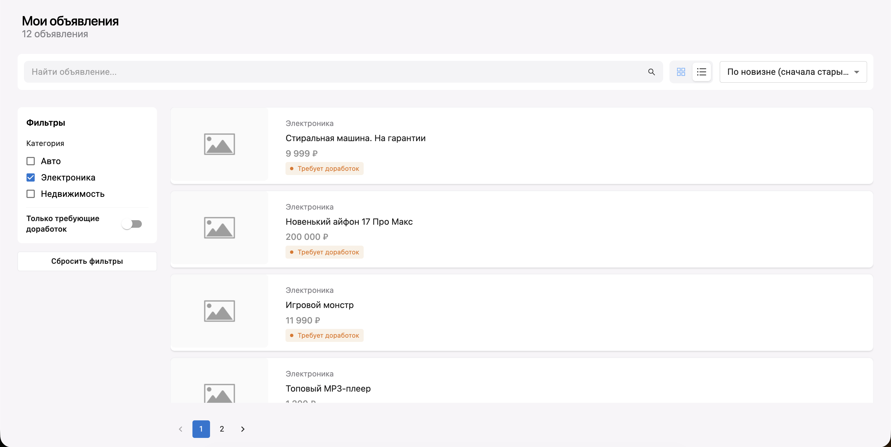
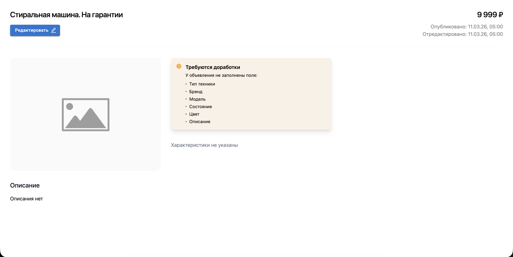
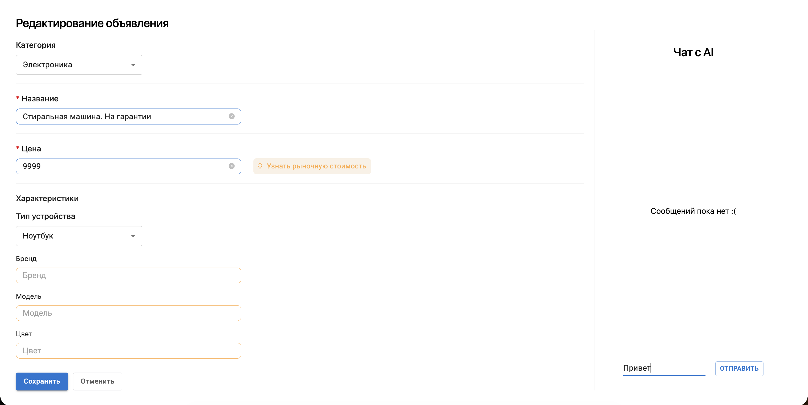

# Тестовое задание avito стажировка





## Запуск через Docker

### Требования

- [Docker](https://docs.docker.com/get-docker/) и Docker Compose (v2).

### Переменные окружения

Compose подставляет значения из **файла `.env` в корне репозитория** (рядом с `docker-compose.yml`). Этот файл **не коммитьте**, если в нём секреты.

Создайте `avito-test-tech-april-2026/.env`:

```env
# Обязательно для функций AI (OpenRouter), иначе в образ фронта попадёт пустой ключ
VITE_OPENROUTER_API_KEY=sk-or-v1-ваш_ключ

# Опционально: если меняете порт или хост API, сначала поправьте docker-compose.yml
# (build.args.VITE_BASE_API_URL), затем пересоберите frontend
```

Переменная **`VITE_OPENROUTER_API_KEY`** должна быть задана **до сборки** образа фронта: в `docker-compose.yml` она передаётся как build-arg (`${VITE_OPENROUTER_API_KEY}`). Файл `frontend/.env` при сборке в Docker **не используется** (он в `.dockerignore`), поэтому ключ для контейнерной сборки задают через корневой `.env` или экспорт в shell.

### Команды

Из корня репозитория:

```bash
docker compose build
docker compose up
```

- Приложение (UI): [http://localhost:3000](http://localhost:3000)
- API: [http://localhost:8080/items](http://localhost:8080/items) (корень `http://localhost:8080/` может отвечать 404 — это нормально для API)

После изменения **`VITE_*`** или **`VITE_OPENROUTER_API_KEY`** пересоберите фронт:

```bash
docker compose build frontend --no-cache
docker compose up
```


Alisher Sharipov